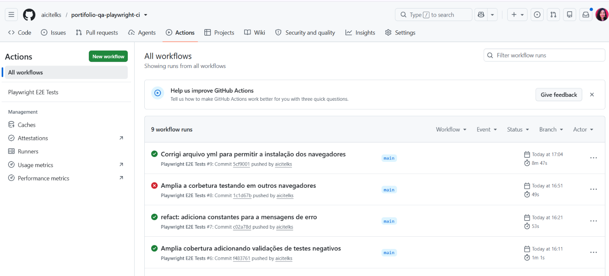
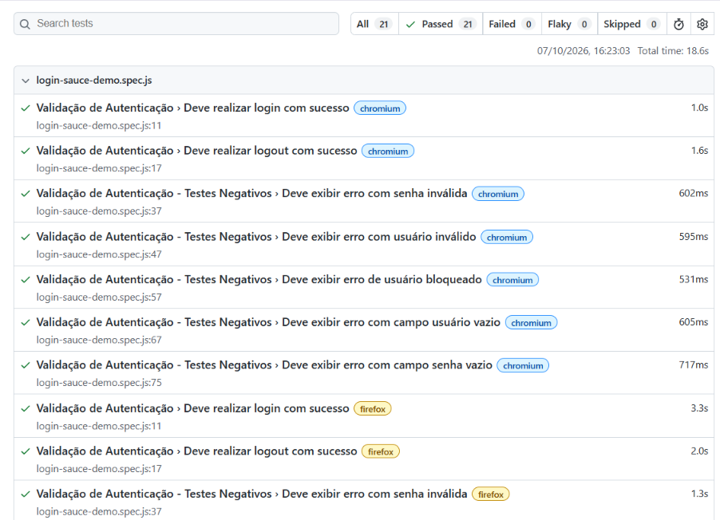

#  Playwright + GitHub Actions: Testes de Login com CI

Projeto de portfólio de **QA Automation** com testes end-to-end de autenticação usando **Playwright**, executados automaticamente em um pipeline de **CI/CD com GitHub Actions** a cada push ou pull request na `main`.

## Objetivo

Validar o fluxo de login da aplicação de demonstração [Sauce Demo](https://www.saucedemo.com) e garantir que os testes rodem de forma automática, gerando um relatório HTML a cada execução.

## Tecnologias

- [Playwright](https://playwright.dev) (Test Runner)
- JavaScript (Node.js)
- GitHub Actions (CI/CD)

## Cenários testados

| #   | Cenário                       | Resultado esperado                               |
| --- | ----------------------------- | ------------------------------------------------ |
| 1   | Login com credenciais válidas | Redireciona para `/inventory` e exibe "Products" |
| 2   | Login com senha inválida      | Exibe mensagem de erro de credenciais            |

## Estrutura do projeto

```
.
├── .github/workflows/ci.yml   # Pipeline de CI
├── tests/login.spec.js                # Testes de login
├── playwright.config.js               # Configuração do Playwright
└── package.json
```

## Como rodar localmente

Pré-requisito: Node.js (versão LTS).

```bash
git clone https://github.com/aicitelks/portifolio-qa-playwright-ci.git
cd portifolio-qa-playwright-ci
npm ci
npx playwright install --with-deps chromium
npx playwright test
```

Para abrir o relatório HTML:

```bash
npx playwright show-report
```

## Pipeline de CI/CD

O workflow em `.github/workflows/ci.yml` executa, a cada push ou pull request na `main`:

1. Checkout do código
2. Configuração do Node.js LTS
3. Instalação das dependências (`npm ci`)
4. Instalação do navegador Chromium
5. Execução dos testes
6. Upload do relatório HTML como artefato (mantido por 14 dias, mesmo se os testes falharem)

Para ver o relatório: aba **Actions**, escolha a execução e baixe o artefato **playwright-report**.





## Boas práticas aplicadas

- Seletores baseados em acessibilidade e atributos estáveis (`getByRole`, `getByPlaceholder`)
- Sem `sleep` ou esperas fixas: uso do auto-wait e de asserções web-first do Playwright
- `baseURL` centralizada na configuração
- Retries somente no CI, para reduzir falsos negativos sem esconder instabilidade local
- Trace e screenshot coletados apenas quando necessário

## Próximos passos

- [ ] Adicionar Page Object Model
- [:heavy_check_mark:] Ampliar a cobertura (logout, usuário bloqueado, campos vazios)
- [:heavy_check_mark:] Executar em múltiplos navegadores (Firefox e WebKit)

---

## Autora

**Letícia Castro**: QA Automation
[LinkedIn](https://www.linkedin.com/in/leticiacastro87) • [GitHub](https://github.com/aicitelks)
